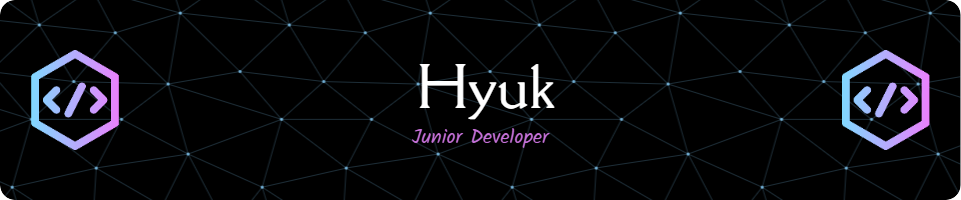

<h1>:bell:About Myself:bell:</h1> 

Hi! I am Hyuk(which means "Shine" in my language btw), a junior backend developer. 
I like traveling each corner of our world. 
I have started learning programming from SSAFY (Samsung Software Academy for Youth)  

-----  
 ### 🔨 technical skills  
 

  
   
    
   
   
   
   

-----  
### 📚 Algorithm  
ksylka 👉   

  
-----
### 📝 GitHub Stats
 

